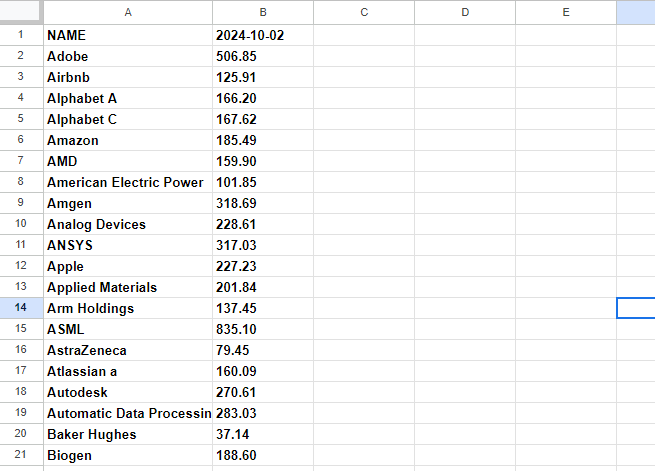

# Nasdaq 100 Stock Prices Web Scraper

This project is a Python-based web scraper that automatically retrieves the daily closing prices of the largest companies listed on the Nasdaq 100 index. The data is scraped from [Markets Insider Nasdaq 100 Components](https://markets.businessinsider.com/index/components/nasdaq_100) and is then written to a Google Spreadsheet for easy access and analysis.



## Features
- **Automated Stock Price Retrieval**: Scrapes daily closing prices of Nasdaq 100 companies from the specified website.
- **Google Sheets Integration**: Writes the scraped data directly into a Google Spreadsheet.
- **Daily Automation**: Can be scheduled to run daily to fetch the latest data.
- **Secure Google OAuth Authentication**: Uses OAuth2 for secure access to your Google Sheets.

## Technologies Used
- **Python**: Core programming language.
- **Selenium**: Web scraping tool used to navigate and extract data from the website.
- **gspread**: Python library for interacting with Google Sheets API.
- **Google OAuth2**: Secure authentication for accessing Google Sheets.

## Requirements

Before setting up and running the project, ensure you have the following:

- **Python 3.12**: You can download it from [python.org](https://www.python.org/downloads/).
- **Google Account**: To access and write data to a Google Spreadsheet.
- **Browser Driver**: Firefox browser installed for Selenium.

## Setup Instructions

### 1. Clone the Repository
First, clone this repository to your local machine:

```bash
git clone https://github.com/alikilicw/nasdaq-stock-prices.git

```

### 2. Install Dependencies
```bash
    pip install -r requirements.txt
```

### 3. Create a Google API Project and Credentials

- Go to [Google Cloud Console](https://console.cloud.google.com/) and create a new project.
- Enable the Google Sheets API and Google Drive API.
- Create OAuth2 credentials and download the `credentials.json` file.
- Move the `credentials.json` file into your project directory.

### 4. Create and Share a Google Spreadsheet

- Create a new Google Spreadsheet in your Google Drive.
- Open the `credentials.json` file and find the `client_email` field.
- Share the newly created Google Spreadsheet with this `client_email` (it will look like `your-project-id@developer.gserviceaccount.com`).

### 5. Update the Spreadsheet Information

- Create an .env file in your project directory.
- Create a data with name `WORKBOOK_ID`. And put your spreadsheet id in that data.

### 6. Run the Program

```bash
python main.py
```

## Automate the Program (Optional)
You can schedule the script to run daily using a task scheduler.

- **On Linux/macOS**: Use `cron` jobs to schedule the program.
- **On Windows**: Use Task Scheduler to automate the execution of the program.